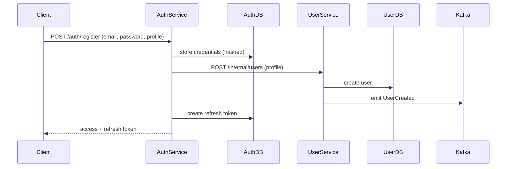
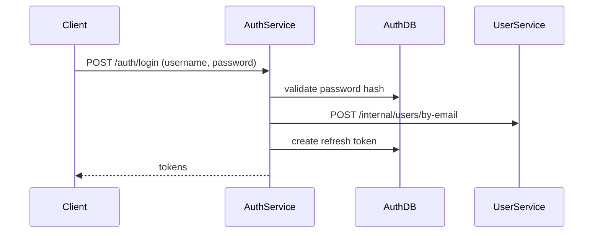
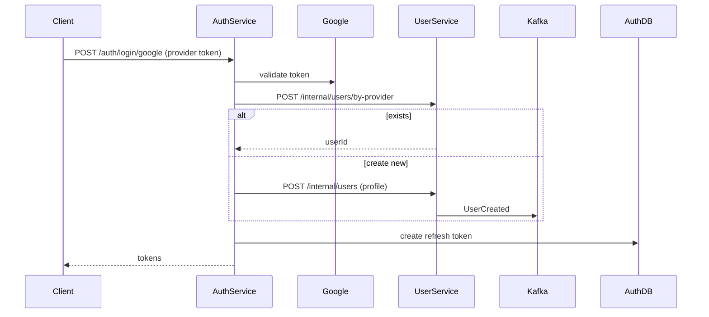
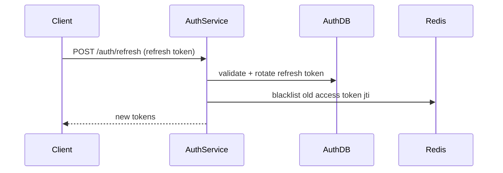
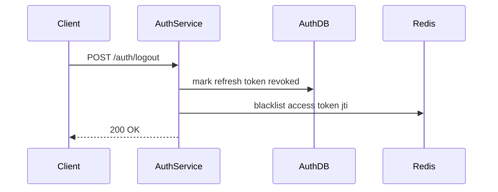
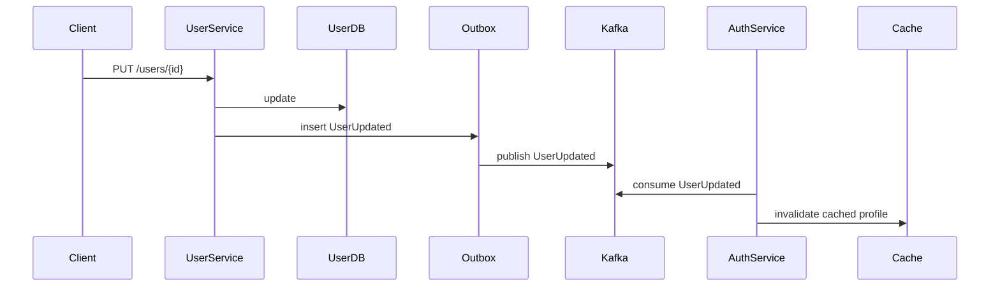

# Product Requirements Document (PRD)

## Auth Service ↔ User Service Interaction

Generated: 2025-09-13T10:04:33.530128Z

---

## 1. Overview

This document specifies **how the Auth Service and User Service interact** within the microservices architecture. The goal is to separate **authentication/session management** from **user profile management** while ensuring secure, reliable, and scalable coordination.

---

## 2. Ownership

- **Auth Service**

  - Manages authentication credentials (password hashes, OAuth provider validation).
  - Issues and revokes **access tokens** (JWT) and **refresh tokens** (persisted).
  - Manages sessions (`refresh_tokens` table, Redis access-token blacklist).
  - Provides token introspection and session APIs.
  - Publishes **session events** (UserSessionCreated, UserSessionRevoked).
- **User Service**

  - Manages **user profile** (username, email, phone, social identities, avatar).
  - Owns the `users` table and `social_identities` table.
  - Emits **user events** (UserCreated, UserUpdated, UserDeleted).
  - Exposes **internal APIs** for Auth Service to fetch minimal profile data.

---

## 3. Communication Patterns

- **Synchronous (REST internal APIs)**Auth Service calls User Service during registration, login (email lookup), and social login (find by provider ID).
- **Asynchronous (Kafka events)**User Service emits profile change events. Auth Service consumes them to update caches or trigger session revocations.
- **Caching**
  Auth Service caches minimal user info (email, email_verified, status) with TTL and invalidates on events.

---

## 4. Data Ownership

| Concern               | Owner        | Notes                                                            |
| --------------------- | ------------ | ---------------------------------------------------------------- |
| Password hashes       | Auth Service | Auth DB stores salted+hashed credentials.                        |
| Access/Refresh tokens | Auth Service | Refresh tokens persisted in Auth DB; access JWTs signed by Auth. |
| User profile          | User Service | Single source of truth.                                          |
| Social identities     | User Service | Links external providers to user IDs.                            |

---

## 5. API Contracts

### Auth Service (public APIs)

- `POST /auth/register`
- `POST /auth/login`
- `POST /auth/login/google`
- `POST /auth/login/facebook`
- `POST /auth/refresh`
- `POST /auth/logout`
- `POST /auth/logout-all`
- `GET /auth/sessions`
- `POST /auth/revoke` (admin)

### User Service (internal APIs for Auth)

- `GET /internal/users/{id}` → minimal profile
- `POST /internal/users/by-email` → lookup by email
- `POST /internal/users/by-provider` → lookup by social identity
- `POST /internal/users` → create new user (profile)
- `POST /internal/users/link-social` → link provider to user

---

## 6. Flows

### 6.1 Registration (email/password)



### 6.2 Login (username/password)



### 6.3 Social Login



### 6.4 Token Refresh



### 6.5 Logout



### 6.6 Profile Update



---

## 7. JWT Design

Claims included in access tokens:

```json
{
  "iss": "https://auth.example.com",
  "sub": "123",
  "aud": "api://default",
  "exp": 169..., "iat": ...,
  "jti": "uuid",
  "sid": "refresh-token-id",
  "roles": ["USER"],
  "email": "jdoe@example.com"
}
```

---

## 8. Events

### From User Service

- `UserCreated`
- `UserUpdated`
- `UserDeleted`

### From Auth Service

- `UserSessionCreated`
- `UserSessionRevoked`

---

## 9. Security

- **mTLS or service JWTs** for internal Auth ↔ User calls.
- Internal endpoints never exposed to public.
- Resource services validate JWT locally via Auth public key.
- Revocation checks done against Redis blacklist.

---

## 10. Failure Handling

- **Retries**: Auth retries UserService calls with backoff.
- **Idempotency**: Internal APIs idempotent by natural key.
- **Consistency**: Eventual consistency via Kafka.
- **Compensation**: If UserService fails during registration, rollback auth credential record.

---

## 11. Deliverables

- Swagger/OpenAPI specs for Auth + User internal APIs.
- Kafka schemas for user + session events.
- Spring Boot services with Gradle, Flyway migrations, Docker Compose setup.
- Postman collection with full flows.
