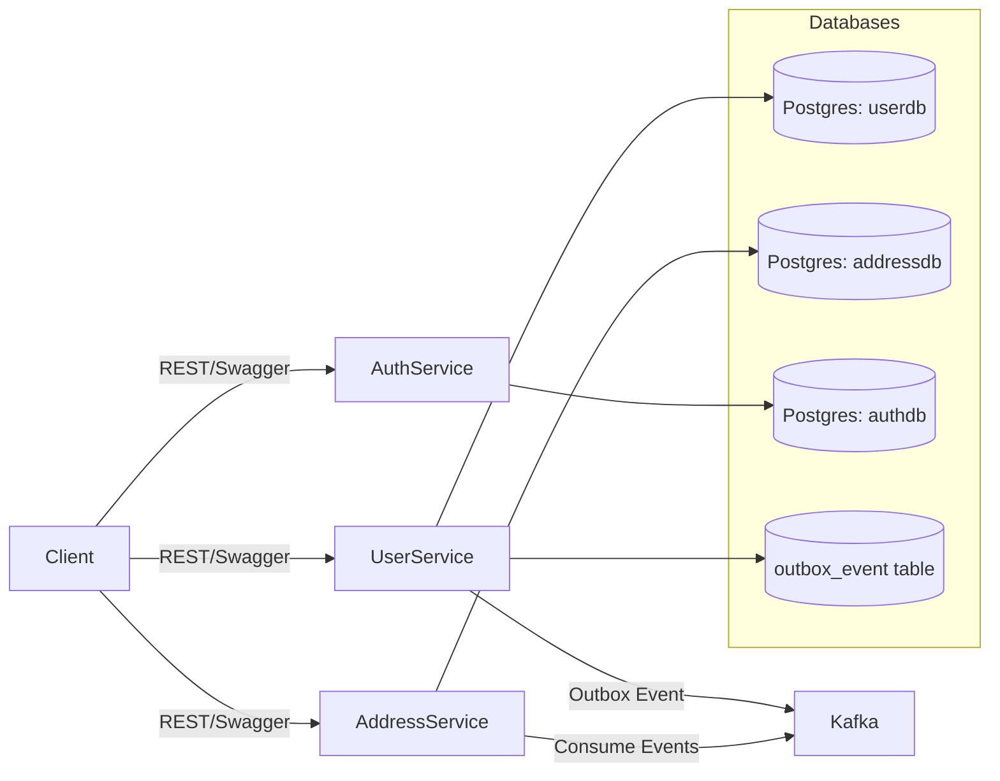

# Product Requirements Document (PRD)  
## Microservices Backend Assignment

---

## 1. Overview
We are building a **microservices-based backend system** consisting of three core services:  
- **Auth Service** (authentication & authorization)  
- **User Service** (user profile management)  
- **Address Service** (user address management)  

The system must support:  
- Secure authentication with username/password and social login (Google, Facebook).  
- Access & Refresh token handling with logout & revocation.  
- CRUD operations for Users and Addresses.  
- **Distributed transactions** between User and Address updates using **Outbox Pattern** (with Kafka).  
- API documentation via Swagger/OpenAPI.  
- Deployment with Docker Compose for local development.

---

## 2. Goals & Non-Goals

### Goals
- Provide **secure authentication & authorization** with token-based access.  
- Manage **users and addresses** with reliable consistency across services.  
- Ensure **eventual consistency** for cross-service updates using **Outbox pattern**.  
- Deliver services as **independently deployable units** with their own databases.  
- Offer a **clear API contract** via Swagger UI.  
- Provide **ready-to-run local setup** with Docker Compose.

### Non-Goals
- Building frontend UI (only Postman collection for demo).  
- Production-grade monitoring, scaling, and CI/CD pipelines.  
- Support for non-relational databases.  

---

## 3. High-Level Architecture



---

## 4. Functional Requirements

### Auth Service
- Register new user (username/password).  
- Login with username/password.  
- Login with Google/Facebook (OAuth2).  
- Issue JWT **access & refresh tokens**.  
- Refresh token endpoint.  
- Logout and logout-all endpoints.  
- Token/session revocation & session listing.  

### User Service
- CRUD for Users (Create, Read, Update, Delete).  
- Manage **social identities** linked to users.  
- Each update generates an **Outbox Event**.  
- Outbox Publisher publishes unprocessed events to Kafka.  

### Address Service
- CRUD for Addresses.  
- Consume **UserUpdated / ProfileUpdated events** from Kafka.  
- Apply address changes idempotently.  
- Enforce **one primary address per user**.  

---

## 5. Non-Functional Requirements
- **Language:** Java 11+ (recommend Java 17).  
- **Frameworks:** Spring Boot, Spring Security, Spring Authorization Server, Spring Data JPA.  
- **Databases:** PostgreSQL.  
- **Message Broker:** Kafka.  
- **API Documentation:** Swagger/OpenAPI.  
- **Deployment:** Docker Compose.  
- **Scalability:** Each service independently deployable.  
- **Consistency:** Eventual consistency between User & Address services.  
- **Resilience:** Retry mechanism for outbox events and Kafka consumers.  
- **Security:** Strong session/token management with refresh token persistence and access token revocation support.  

---

## 6. Token Management (Auth Service)

### Principles
- Access tokens are **short-lived JWTs** (5–15 min).  
- Refresh tokens are **persisted in DB** for session management.  
- Refresh token rotation is enforced.  
- JWTs include `jti` (unique id) and `sid` (session id / refresh token id).  
- Redis is used to store revoked access token IDs (`jti`) for immediate invalidation.  

### Tables

#### `refresh_tokens`
```sql
CREATE TABLE refresh_tokens (
  id UUID PRIMARY KEY DEFAULT gen_random_uuid(),
  user_id BIGINT NOT NULL,
  client_id VARCHAR(100),
  device_info TEXT,
  ip_address VARCHAR(45),
  created_at TIMESTAMPTZ DEFAULT now(),
  last_used_at TIMESTAMPTZ,
  expires_at TIMESTAMPTZ NOT NULL,
  revoked BOOLEAN DEFAULT false,
  replaced_by UUID,
  metadata JSONB,
  CONSTRAINT fk_user FOREIGN KEY (user_id) REFERENCES users(id)
);
```

#### `revoked_access_tokens` (if DB-based, otherwise use Redis)
```sql
CREATE TABLE revoked_access_tokens (
  jti UUID PRIMARY KEY,
  user_id BIGINT,
  revoked_at TIMESTAMPTZ DEFAULT now(),
  expires_at TIMESTAMPTZ NOT NULL
);
```

### Auth APIs
- `POST /auth/register`  
- `POST /auth/login`  
- `POST /auth/login/google`  
- `POST /auth/login/facebook`  
- `POST /auth/refresh`  
- `POST /auth/logout` → revokes refresh & access token  
- `POST /auth/logout-all` → revokes all sessions for user  
- `GET /auth/sessions` → list active sessions  
- `POST /auth/revoke` → admin revoke by session id  

---

## 7. API Contracts

(see earlier sections for details of each endpoint)

---

## 8. Data Models

### User (user-service)
```sql
CREATE TABLE users (
  id BIGSERIAL PRIMARY KEY,
  username VARCHAR(50) UNIQUE,
  email VARCHAR(100) UNIQUE NOT NULL,
  email_verified BOOLEAN DEFAULT false,
  mobile VARCHAR(15),
  first_name VARCHAR(50),
  last_name VARCHAR(50),
  avatar_url VARCHAR(255),
  created_at TIMESTAMP DEFAULT now(),
  updated_at TIMESTAMP DEFAULT now()
);
```

### Social Identities (user-service)
```sql
CREATE TABLE social_identities (
  id BIGSERIAL PRIMARY KEY,
  user_id BIGINT NOT NULL,
  provider VARCHAR(50) NOT NULL,
  provider_user_id VARCHAR(200) NOT NULL,
  access_token TEXT,
  refresh_token TEXT,
  token_expires_at TIMESTAMPTZ,
  profile JSONB,
  linked_at TIMESTAMPTZ DEFAULT now(),
  CONSTRAINT fk_user FOREIGN KEY (user_id) REFERENCES users(id)
);
CREATE UNIQUE INDEX ux_provider_user ON social_identities (provider, provider_user_id);
```

### Address (address-service)
```sql
CREATE TABLE addresses (
  id BIGSERIAL PRIMARY KEY,
  user_id BIGINT NOT NULL,
  line1 VARCHAR(255) NOT NULL,
  city VARCHAR(100),
  state VARCHAR(100),
  country VARCHAR(100),
  postal_code VARCHAR(20),
  is_primary BOOLEAN DEFAULT false,
  created_at TIMESTAMP DEFAULT now(),
  updated_at TIMESTAMP DEFAULT now()
);
```

### Outbox Event (user-service)
```sql
CREATE TABLE outbox_event (
  id UUID PRIMARY KEY,
  aggregate_type VARCHAR(50),
  aggregate_id VARCHAR(50),
  type VARCHAR(100),
  payload JSONB,
  occurred_at TIMESTAMP DEFAULT now(),
  processed BOOLEAN DEFAULT false
);
```

---

## 9. Project Structure

```
/project-root
├── docker/                          # Docker configs, networks, helper scripts
│   └── docker-compose.yml            # local compose (postgres, kafka, redis, services)
│
├── auth-service/                     # Auth service
│   ├── src/main/java/com/example/authservice/...
│   ├── src/main/resources/
│   │   ├── application.yml
│   │   └── db/migration/             # Flyway migrations
│   │       └── V1__init_auth_schema.sql
│   ├── pom.xml / build.gradle
│   └── Dockerfile
│
├── user-service/                     # User service
│   ├── src/main/java/com/example/userservice/...
│   ├── src/main/resources/
│   │   └── db/migration/
│   │       └── V1__init_user_schema.sql
│   ├── pom.xml / build.gradle
│   └── Dockerfile
│
├── address-service/                  # Address service
│   ├── src/main/java/com/example/addressservice/...
│   ├── src/main/resources/
│   │   └── db/migration/
│   │       └── V1__init_address_schema.sql
│   ├── pom.xml / build.gradle
│   └── Dockerfile
│
├── libs/                             # Shared DTOs/events libraries
├── docs/                             # Documentation (PRD, API specs, diagrams)
├── postman/                          # Postman collections
├── ci/                               # CI/CD pipelines
└── README.md
```

---

## 10. Migration Strategy

- Use **Flyway** for all database migrations (per service).  
- Each service has its own `db/migration` folder with versioned files:  
  - `V1__init_schema.sql`  
  - `V2__add_columns.sql`  
- **Spring config**:  
  ```yaml
  spring:
    jpa:
      hibernate:
        ddl-auto: validate
    flyway:
      enabled: true
      baseline-on-migrate: true
      locations: classpath:db/migration
  ```
- Dev: `ddl-auto=create-drop` for fast local prototyping.  
- Prod: always use Flyway migrations, never rely on Hibernate auto-update.  

---

## 11. Sequence Flow

(see earlier diagrams for user update and logout flows)

---

## 12. Deployment

- Docker Compose for local dev (Postgres x3, Kafka, Redis, services).  
- Optional: Kubernetes manifests under `/infra`.  

---

## 13. Deliverables

- Source code (auth-service, user-service, address-service).  
- Flyway migrations per service.  
- Swagger/OpenAPI specs.  
- Postman collection.  
- README developer guide.  

---

## 14. Future Enhancements

- API Gateway (Spring Cloud Gateway).  
- Service discovery (Eureka/Consul).  
- Central config service.  
- Monitoring (Prometheus, Grafana).  
- CI/CD pipelines.  

---
